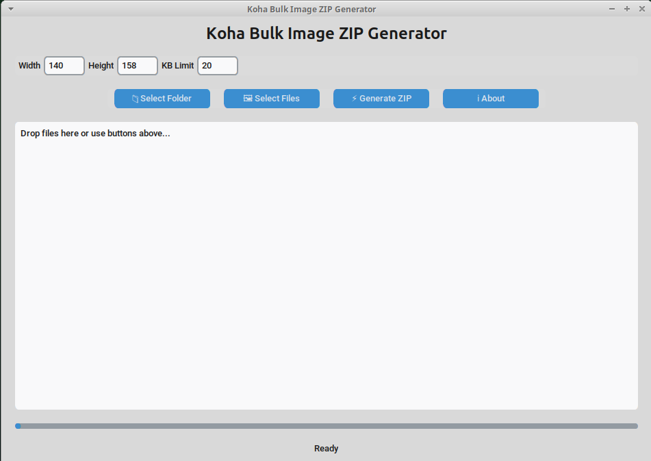
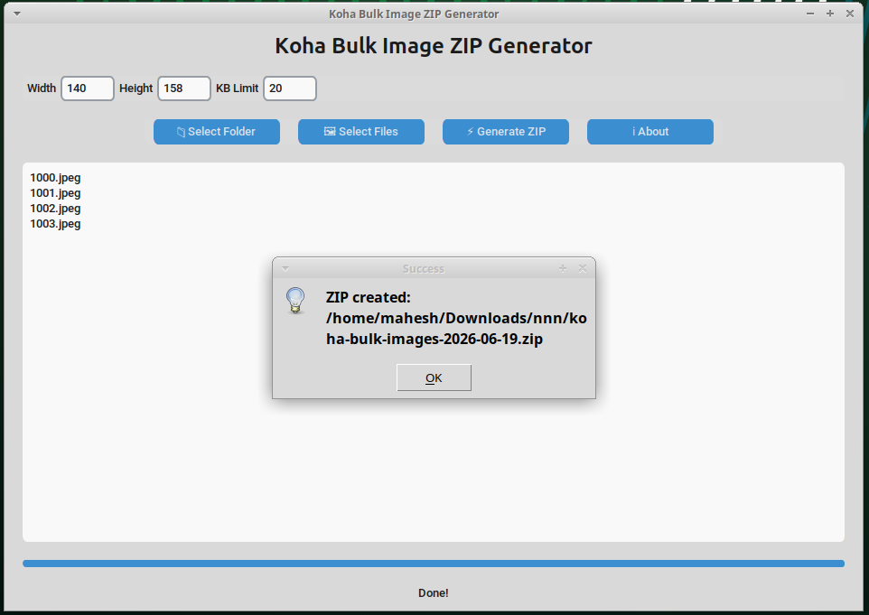

# Koha Bulk Image Processing Tool

A modern Linux desktop application to batch resize patron images and generate Koha-compatible ZIP packages with `IDLINK.TXT`.

Developed for **library automation workflows**, especially for Koha Library Management System users.

---

## ✨ Features

- 📁 Select images or entire folders
- 🖱️ Drag & drop support
- 🖼️ Batch image resize (custom width & height)
- 📦 Automatic ZIP creation
- 🧾 Generates `IDLINK.TXT` for Koha import
- ⚡ Fast batch processing
- 📊 Progress bar indicator
- ⚙️ User-configurable settings (size, width, height)
- 🖥️ Modern GUI using CustomTkinter
- 💻 Linux desktop application (.deb support)

---

## 🖥️ Screenshot 




---
### Installation

## ⬇️ Download Latest Release (.deb)

You can always download the latest `.deb` package from the GitHub Releases page:

👉 **Latest Release (Recommended):**  
https://github.com/maheshpalamuttath/koha-bulk-image-zip-generator/releases/latest

### Option 1: Install .deb package (Recommended)

```bash
sudo apt install ./koha-bulk-image-tool_2.2_amd64.deb
````

## How It Works

1. Select a folder or images
2. Images are resized to Koha format (default: 140x158)
3. File size is optimized (default: 20 KB)
4. Application generates:

   * Resized JPEG images
   * `IDLINK.TXT` mapping file
   * ZIP archive ready for Koha upload

---

## Output Format

```
12345.jpeg
12346.jpeg
IDLINK.TXT
```

### IDLINK.TXT format:

```
12345    12345.jpeg
12346    12346.jpeg
```
---

## ⚙️ Requirements

* Ubuntu / Debian / Linux Mint
* Python 3.8+
* CustomTkinter
* Pillow
* tkinterdnd2
---

## Author

**Mahesh Palamuttath**
📧 Email: [maheshpalamuttath@gmail.com](mailto:maheshpalamuttath@gmail.com)
📱 Mobile: +91 9567 664 972
🌐 Website: [https://maheshpalamuttath.info](https://maheshpalamuttath.info)

---

## Use Case

Designed for:

* Koha Library Systems
* Library staff bulk photo processing
* Academic institutions
* Digital library workflows

---

## Future Improvements

* AppImage build (no install required)
* Auto-update system
* Cloud sync support
* Advanced image preview
* Role-based batch processing

---

## ⭐ Support

If you find this project useful, please star ⭐ the repository and share it with other library professionals.
